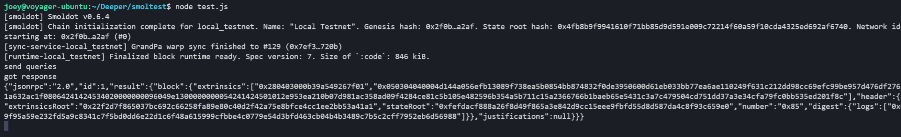
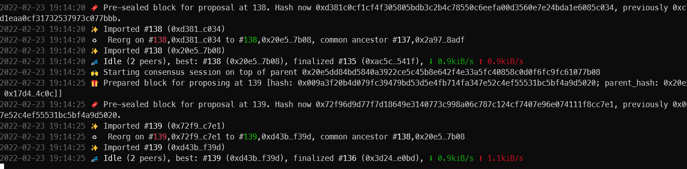
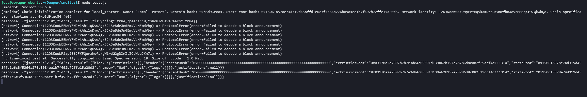
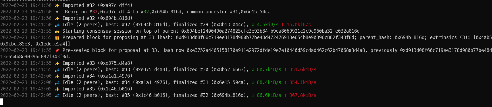

# smoltest

## 测试版本7

commit: v1.7.0.3 cherry-pick 84bcabc436a538358e1cee005e014998321506cd

运行2节点测试网

```bash
./deeper-chain-7 --base-path /tmp/alice-7 --chain local --alice --validator --rpc-cors all
./deeper-chain-7 --base-path /tmp/bob-7 --chain local --bob --validator --bootnodes /ip4/127.0.0.1/tcp/30333/p2p/12D3KooWLJsQDd9WkeFGxSVckVFyDaBNaYKp9aDnzBk1AdFskJrK # id of alice
```

编辑deeper-chain-7.json，修改最新的bootnodes

`node test.js`




## 测试版本10

commit: cc2a8ec5aeafbc6d0c35c7da7fc717d6e3a75e30

运行2节点测试网

```bash
./deeper-chain-10 --base-path /tmp/alice-10 --chain local --alice --validator --rpc-cors all
./deeper-chain-10 --base-path /tmp/bob-10 --chain local --bob --validator --bootnodes /ip4/127.0.0.1/tcp/30333/p2p/12D3KooWEENwYFWJrkAhi1qDvwAgk3Jk3eBdeJn6EmqVLNFmdVbp # id of alice
```

编辑deeper-chain-7.json，修改最新的bootnodes

`node test.js`


